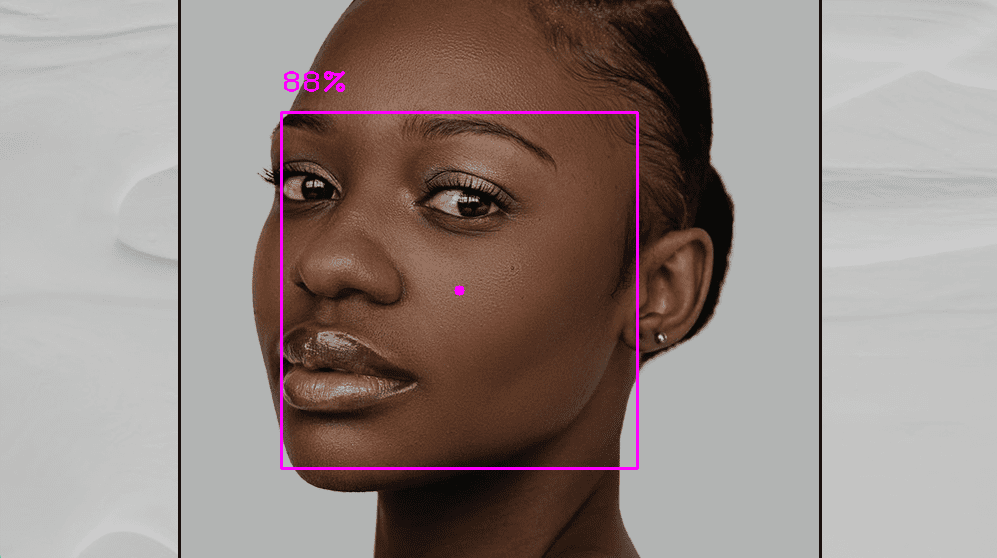

<p align="center"></p>


This is a Computer vision package that makes its easy to run Image processing and AI functions. At the core it uses [OpenCV](https://github.com/opencv/opencv) and [Mediapipe](https://github.com/google/mediapipe) libraries. 

## Installation
You can simply use pip to install the latest version of visionx.

`pip install visionx`

<h4>OR</h4>

```shell
git clone https://github.com/Mohak-CODING-HEAVEN/VisionX.git
cd VisionX
python setup.py install
```

<hr>

### Face Detection

<hr>

<p align=center></p>

**Code**

```python
from visionx.FaceDetectionModule import FaceDetector
import cv2

cap = cv2.VideoCapture(0)
detector = FaceDetector()
while True:
    success, img = cap.read()
    img, bboxs = detector.findFaces(img)

    if bboxs:
        # bboxInfo - "id","bbox","score","center"
        center = bboxs[0]["center"]
        cv2.circle(img, center, 5, (255, 0, 255), cv2.FILLED)

    cv2.imshow("Image", img)
    cv2.waitKey(1)
```

